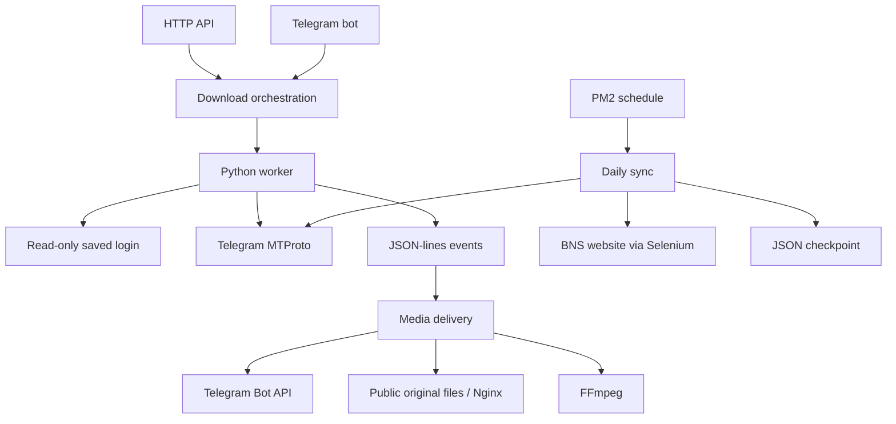

# Architecture review

Reviewed against the working tree on October 7, 2026, including the existing parallel-download and session-isolation changes.

## Current boundaries

The Node/Python split is appropriate: Node hosts the HTTP/bot interfaces and delivery, while Python owns Telethon. Keep the separate daily process; it has different scheduling and integration concerns. A full framework rewrite or new remote service is unnecessary for the present repository.

`server.js` now composes services; `src/api.js` and `src/bot.js` adapt incoming requests; `src/download-flow.js` manages worker events; `src/media-delivery.js` decides how to deliver a file. Publication, encoding, and event parsing have independent modules. Their factories accept collaborators, so tests import modules directly without extracting strings from `server.js` or launching a real bot.

Python worker entry points stay at the root to preserve PM2 commands and sibling imports. Optional tools are separated under `tools/`. Their lack of imports from the core is not proof that nobody runs them manually, so they were retained.

## Changes made in this cleanup

- Extracted Node responsibilities into `src/` and anchored server paths to its directory.
- Preserved the existing worker session isolation, parallel transfer implementation, progress coalescing, and invite retry behavior.
- Removed the duplicate interactive downloader (`grabber.py`), empty `box.js`, unused `human` formatter, unused Selenium `_extract_card_error`, unused scraper `JSONStore.write`, and redundant local imports.
- Moved the optional scraper, image analyzer, and migration CLI to `tools/`; retained image samples and scraper data locations.
- Corrected a pre-existing indentation error in the scraper's rate-limit exception handler.
- Added usable `npm start`, environment and PM2 templates, optional-tool requirements, and updated setup documentation.
- Added ignores and removed runtime logs, checkpoints, and authenticated session files from Git tracking while keeping local copies.

## Prioritized follow-ups

### 1. Make daily sync recovery reliable

`daily_bns_sync.py:main` fetches `get_messages(..., limit=200)` and checkpoints `last_id`. A failed message can be followed by a successful newer message that advances `last_id` beyond the failure. A download returning no path explicitly advances it too. Website errors are logged/returned but do not prevent a later successful Telegram upload from advancing the same checkpoint. A backlog larger than 200 messages is never fully examined.

Use a persistent per-message record keyed by source channel and message ID, with separate Telegram and website delivery status, attempt counts, and retry errors. Fetch messages after the checkpoint using pagination. Advance the scan cursor only after recording every discovered item; retry incomplete destinations independently. A local SQLite database is sufficient. Add tests for failure followed by success, partial destination success, restart after send-before-checkpoint, and a backlog over 200 messages before changing production behavior.

As an interim fix, fail the run at the first incomplete message and replace JSON checkpoints atomically. Do not replay failures blindly: Telegram may already have accepted a send before the checkpoint was written. A per-destination delivery record is needed to manage duplicate risk.

### 2. Bound download jobs and own their lifecycle

Every bot message or accepted API request immediately spawns a process. `DOWNLOAD_WORKERS` bounds streams within one worker, not the total number of active workers. The API has an HTTP rate limit; bot traffic has no corresponding admission limit. SIGINT/SIGTERM currently stop bot polling only, and invite entries expire only when that chat sends another message.

Introduce one job manager shared by both adapters, with a global concurrency cap, queue limit, per-chat limit, tracked child processes, and graceful shutdown. Expire invite state periodically. Remove empty completed job directories and establish retention for failed-delivery files; currently only the public download directory has expiry cleanup. Test overload, shutdown during transfer/delivery, and retry retention. A persistent queue becomes useful if restart recovery is required; start with a bounded in-process manager if it is not.

### 3. Separate the BNS website adapter from sync policy

The daily script combines credential resolution, Selenium selectors and browser diagnostics, FFmpeg conversion, notifications, checkpointing, and orchestration. Extract a website adapter with explicit success/duplicate/failure results, an audio conversion module, and a state repository. Keep `daily_bns_sync.py` as the CLI adapter. Selenium is synchronous inside the async flow; isolate it before attempting concurrent sync work. A website upload API would reduce selector fragility if the website supports one.

The script also searches neighboring project environment files and falls back to built-in admin credentials. Replace that with explicit, validated configuration. `--outdir` is accepted but unused because each message uses `tempfile.mkdtemp`; either implement it or deprecate it in the operator guide and CLI together.

### 4. Tighten configuration and readiness reporting

Validate numeric settings and required executables before starting work. A failed `bot.launch()` is only logged while `/healthz` still returns success; expose separate readiness for bot polling and the worker environment. Keep liveness distinct from readiness.

Both bot and signed API requests use one authenticated Telegram user account. Before exposing the bot broadly, define who may request downloads or ask that account to join private channels; add explicit user/chat authorization to match that policy. HMAC validates API callers but is not bot authorization and currently has no timestamp/nonce for replay protection.

### 5. Consolidate optional image tooling only if it is still needed

The analyzer and scraper use different Gemini clients and have separate configuration conventions. Their optional dependencies are now isolated, but live behavior is unverified. Choose one supported SDK/model configuration and add fake-provider tests before promoting this work into the core service. If these experiments are abandoned, delete the tools and associated sample images together after confirming that usage.

## Repository data and credentials

Authenticated Telegram session databases and runtime diagnostics were tracked. The cleanup preserves local files but stages their removal from the repository. It does not erase historical commits. If this repository has been shared beyond trusted operators, revoke the committed Telegram sessions and review historical credentials; removing files from the latest tree does not invalidate a login. Preserve `.state/` during deployment to avoid accidental checkpoint reset.

## Validation scope

Core Node/Python tests exercise simulated Telegram events/transfers and real local FFmpeg conversion. API tests use a local Express server with a fake Telegram client. All retained Python files are syntax-checked. No live Telegram messages, channel joins, BNS uploads, or Gemini requests are part of cleanup validation. Existing production PM2 settings and live services are not modified.
